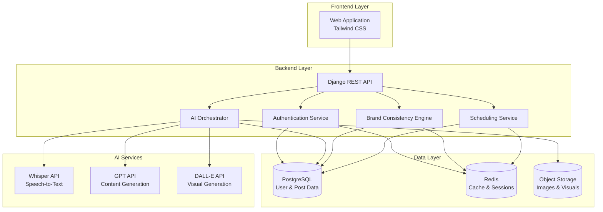

# Design Document: TARANG AI Marketing Platform

## Overview

TARANG is a voice-first AI marketing platform that enables Indian SMB owners to create professional social media content through conversational interfaces in regional languages. The system orchestrates multiple AI services (Whisper, GPT, DALL-E) through a Django backend, providing a seamless web interface for content creation, brand consistency management, and strategic scheduling.

The architecture follows a three-tier model:
1. **Frontend Layer**: Tailwind CSS web application hosted on Supabase
2. **Backend Layer**: Django REST Framework API with PostgreSQL and Redis
3. **AI Services Layer**: OpenAI APIs (Whisper, GPT, DALL-E) for content generation

## Architecture

### System Components



### Component Responsibilities

**Frontend Layer:**
- Voice recording and audio file upload
- Text input for product descriptions
- Image upload and preview
- Content preview and editing interface
- Post history browsing
- Campaign suggestion display

**Django REST API:**
- Request routing and validation
- Authentication and authorization
- Rate limiting and throttling
- Error handling and response formatting
- API documentation (OpenAPI/Swagger)

**AI Orchestrator:**
- Coordinates calls to Whisper, GPT, and DALL-E
- Implements retry logic with exponential backoff
- Manages API rate limits and quotas
- Aggregates results from multiple AI services
- Handles partial failures gracefully

**Brand Consistency Engine:**
- Analyzes historical posts for voice and style patterns
- Extracts color palettes from visual content
- Computes consistency scores for new content
- Caches brand profiles for performance
- Updates brand profiles as new content is created

**Scheduling Service:**
- Analyzes engagement patterns from post history
- Generates optimal posting time recommendations
- Suggests campaign themes based on calendar events
- Considers regional cultural events and festivals
- Provides proactive content reminders

**Authentication Service:**
- User registration and login
- Password hashing (bcrypt)
- Session management with Redis
- JWT token generation and validation
- Password reset via email

### Data Flow

**Content Creation Flow:**
1. User provides voice/text input + product images via WebApp
2. API receives request, validates authentication
3. If voice input: Orchestrator calls Whisper API for transcription and language detection
4. Orchestrator calls GPT API with transcribed text to generate bilingual captions and hashtags
5. Orchestrator calls DALL-E API with product images to generate poster/reel visuals
6. Brand Engine validates consistency with historical brand profile
7. Results aggregated and returned to WebApp for preview
8. User edits and approves content
9. Final content saved to PostgreSQL, images to Object Storage

**Brand Analysis Flow:**
1. Scheduler triggers periodic brand profile updates
2. Brand Engine queries PostgreSQL for user's historical posts
3. GPT API analyzes text content for voice patterns
4. Image analysis extracts dominant colors from visuals
5. Brand profile computed and cached in Redis
6. Profile used for subsequent content generation requests

## Components and Interfaces

### REST API Endpoints

#### Authentication Endpoints

```
POST /api/v1/auth/register
Request:
{
  "email": "string",
  "password": "string",
  "business_name": "string",
  "industry": "string"
}
Response: 201 Created
{
  "user_id": "uuid",
  "email": "string",
  "token": "jwt_string"
}
```

```
POST /api/v1/auth/login
Request:
{
  "email": "string",
  "password": "string"
}
Response: 200 OK
{
  "user_id": "uuid",
  "token": "jwt_string",
  "expires_at": "iso8601_timestamp"
}
```

```
POST /api/v1/auth/reset-password
Request:
{
  "email": "string"
}
Response: 200 OK
{
  "message": "Password reset email sent"
}
```

#### Content Generation Endpoints

```
POST /api/v1/content/generate
Request (multipart/form-data):
{
  "audio_file": "file (optional)",
  "text_input": "string (optional)",
  "language": "string (optional, auto-detected if not provided)",
  "product_images": ["file", "file", ...],
  "content_type": "post | reel"
}
Response: 200 OK
{
  "content_id": "uuid",
  "caption": {
    "english": "string",
    "regional": "string",
    "detected_language": "string"
  },
  "hashtags": ["string", ...],
  "visuals": [
    {
      "url": "string",
      "type": "poster | reel",
      "dimensions": {"width": int, "height": int}
    }
  ],
  "brand_consistency_score": float,
  "generation_time_ms": int
}
```

```
PUT /api/v1/content/{content_id}
Request:
{
  "caption": {
    "english": "string",
    "regional": "string"
  },
  "hashtags": ["string", ...],
  "approved": boolean
}
Response: 200 OK
{
  "content_id": "uuid",
  "updated_at": "iso8601_timestamp"
}
```

#### Post History Endpoints

```
GET /api/v1/posts?start_date={date}&end_date={date}&type={post|reel}
Response: 200 OK
{
  "posts": [
    {
      "post_id": "uuid",
      "created_at": "iso8601_timestamp",
      "caption": {"english": "string", "regional": "string"},
      "hashtags": ["string", ...],
      "visuals": [{"url": "string", "type": "string"}],
      "engagement_metrics": {
        "likes": int,
        "comments": int,
        "shares": int
      }
    }
  ],
  "total_count": int,
  "page": int,
  "page_size": int
}
```

```
POST /api/v1/posts/{post_id}/duplicate
Response: 200 OK
{
  "content_id": "uuid",
  "caption": {...},
  "hashtags": [...],
  "visuals": [...]
}
```

#### Scheduling Endpoints

```
GET /api/v1/schedule/suggestions?content_id={uuid}
Response: 200 OK
{
  "suggested_times": [
    {
      "datetime": "iso8601_timestamp",
      "confidence_score": float,
      "reason": "string"
    }
  ],
  "timezone": "string"
}
```

```
GET /api/v1/campaigns/suggestions
Response: 200 OK
{
  "campaigns": [
    {
      "campaign_id": "uuid",
      "theme": "string",
      "description": "string",
      "suggested_start_date": "iso8601_date",
      "posting_frequency": "string",
      "content_ideas": ["string", ...]
    }
  ]
}
```

#### Brand Profile Endpoints

```
GET /api/v1/brand/profile
Response: 200 OK
{
  "brand_profile": {
    "voice_characteristics": {
      "tone": "string",
      "vocabulary_patterns": ["string", ...],
      "messaging_themes": ["string", ...]
    },
    "visual_style": {
      "dominant_colors": ["#hex", ...],
      "color_palette": ["#hex", ...]
    },
    "consistency_threshold": float,
    "last_updated": "iso8601_timestamp",
    "post_count": int
  }
}
```

### Database Schema

#### Users Table
```sql
CREATE TABLE users (
  user_id UUID PRIMARY KEY DEFAULT gen_random_uuid(),
  email VARCHAR(255) UNIQUE NOT NULL,
  password_hash VARCHAR(255) NOT NULL,
  business_name VARCHAR(255),
  industry VARCHAR(100),
  target_audience TEXT,
  created_at TIMESTAMP DEFAULT CURRENT_TIMESTAMP,
  updated_at TIMESTAMP DEFAULT CURRENT_TIMESTAMP
);

CREATE INDEX idx_users_email ON users(email);
```

#### Posts Table
```sql
CREATE TABLE posts (
  post_id UUID PRIMARY KEY DEFAULT gen_random_uuid(),
  user_id UUID REFERENCES users(user_id) ON DELETE CASCADE,
  caption_english TEXT,
  caption_regional TEXT,
  detected_language VARCHAR(50),
  hashtags TEXT[], -- Array of hashtags
  content_type VARCHAR(20), -- 'post' or 'reel'
  brand_consistency_score FLOAT,
  approved BOOLEAN DEFAULT FALSE,
  created_at TIMESTAMP DEFAULT CURRENT_TIMESTAMP,
  updated_at TIMESTAMP DEFAULT CURRENT_TIMESTAMP
);

CREATE INDEX idx_posts_user_id ON posts(user_id);
CREATE INDEX idx_posts_created_at ON posts(created_at DESC);
CREATE INDEX idx_posts_user_created ON posts(user_id, created_at DESC);
```

#### Visuals Table
```sql
CREATE TABLE visuals (
  visual_id UUID PRIMARY KEY DEFAULT gen_random_uuid(),
  post_id UUID REFERENCES posts(post_id) ON DELETE CASCADE,
  storage_url TEXT NOT NULL,
  visual_type VARCHAR(20), -- 'poster', 'reel', 'product_image'
  width INT,
  height INT,
  file_size_bytes BIGINT,
  created_at TIMESTAMP DEFAULT CURRENT_TIMESTAMP
);

CREATE INDEX idx_visuals_post_id ON visuals(post_id);
```

#### Brand Profiles Table
```sql
CREATE TABLE brand_profiles (
  profile_id UUID PRIMARY KEY DEFAULT gen_random_uuid(),
  user_id UUID UNIQUE REFERENCES users(user_id) ON DELETE CASCADE,
  voice_tone VARCHAR(100),
  vocabulary_patterns JSONB,
  messaging_themes JSONB,
  dominant_colors TEXT[],
  color_palette TEXT[],
  consistency_threshold FLOAT DEFAULT 0.8,
  post_count INT DEFAULT 0,
  last_analyzed_at TIMESTAMP,
  created_at TIMESTAMP DEFAULT CURRENT_TIMESTAMP,
  updated_at TIMESTAMP DEFAULT CURRENT_TIMESTAMP
);

CREATE INDEX idx_brand_profiles_user_id ON brand_profiles(user_id);
```

#### Engagement Metrics Table
```sql
CREATE TABLE engagement_metrics (
  metric_id UUID PRIMARY KEY DEFAULT gen_random_uuid(),
  post_id UUID REFERENCES posts(post_id) ON DELETE CASCADE,
  likes INT DEFAULT 0,
  comments INT DEFAULT 0,
  shares INT DEFAULT 0,
  recorded_at TIMESTAMP DEFAULT CURRENT_TIMESTAMP
);

CREATE INDEX idx_engagement_post_id ON engagement_metrics(post_id);
```

### Redis Cache Structure

**Session Storage:**
```
Key: session:{user_id}
Value: {
  "token": "jwt_string",
  "expires_at": timestamp,
  "user_email": "string"
}
TTL: 7 days
```

**Brand Profile Cache:**
```
Key: brand_profile:{user_id}
Value: {
  "voice_characteristics": {...},
  "visual_style": {...},
  "consistency_threshold": float,
  "last_updated": timestamp
}
TTL: 24 hours
```

**Rate Limiting:**
```
Key: rate_limit:{user_id}:{endpoint}
Value: request_count
TTL: 1 hour
```

## Data Models

### Core Domain Models

**User Model:**
```python
class User:
    user_id: UUID
    email: str
    password_hash: str
    business_name: str
    industry: str
    target_audience: str
    created_at: datetime
    updated_at: datetime
    
    def verify_password(self, password: str) -> bool
    def update_profile(self, **kwargs) -> None
```

**Post Model:**
```python
class Post:
    post_id: UUID
    user_id: UUID
    caption: BilingualText
    hashtags: List[str]
    content_type: ContentType  # Enum: POST, REEL
    brand_consistency_score: float
    approved: bool
    visuals: List[Visual]
    created_at: datetime
    updated_at: datetime
    
    def to_dict(self) -> dict
    def update_caption(self, caption: BilingualText) -> None
    def add_visual(self, visual: Visual) -> None
```

**BilingualText Model:**
```python
class BilingualText:
    english: str
    regional: str
    detected_language: str
    
    def validate(self) -> bool
    def to_dict(self) -> dict
```

**Visual Model:**
```python
class Visual:
    visual_id: UUID
    post_id: UUID
    storage_url: str
    visual_type: VisualType  # Enum: POSTER, REEL, PRODUCT_IMAGE
    dimensions: Dimensions
    file_size_bytes: int
    created_at: datetime
    
    def get_cdn_url(self) -> str
```

**BrandProfile Model:**
```python
class BrandProfile:
    profile_id: UUID
    user_id: UUID
    voice_characteristics: VoiceCharacteristics
    visual_style: VisualStyle
    consistency_threshold: float
    post_count: int
    last_analyzed_at: datetime
    
    def compute_consistency_score(self, new_content: Post) -> float
    def update_from_posts(self, posts: List[Post]) -> None
    def is_stale(self) -> bool
```

**VoiceCharacteristics Model:**
```python
class VoiceCharacteristics:
    tone: str
    vocabulary_patterns: List[str]
    messaging_themes: List[str]
    
    def extract_from_text(self, text: str) -> None
    def similarity_score(self, other_text: str) -> float
```

**VisualStyle Model:**
```python
class VisualStyle:
    dominant_colors: List[str]  # Hex color codes
    color_palette: List[str]
    
    def extract_from_image(self, image_url: str) -> None
    def color_distance(self, other_colors: List[str]) -> float
```

### Service Layer Models

**ContentGenerationRequest:**
```python
class ContentGenerationRequest:
    user_id: UUID
    audio_file: Optional[bytes]
    text_input: Optional[str]
    language: Optional[str]
    product_images: List[bytes]
    content_type: ContentType
    
    def validate(self) -> bool
    def has_voice_input(self) -> bool
```

**ContentGenerationResponse:**
```python
class ContentGenerationResponse:
    content_id: UUID
    caption: BilingualText
    hashtags: List[str]
    visuals: List[Visual]
    brand_consistency_score: float
    generation_time_ms: int
    
    def to_dict(self) -> dict
```

**ScheduleSuggestion:**
```python
class ScheduleSuggestion:
    datetime: datetime
    confidence_score: float
    reason: str
    timezone: str
    
    def is_optimal(self) -> bool
```

**CampaignSuggestion:**
```python
class CampaignSuggestion:
    campaign_id: UUID
    theme: str
    description: str
    suggested_start_date: date
    posting_frequency: str
    content_ideas: List[str]
    
    def to_dict(self) -> dict
```

## Data Models (continued)

### AI Service Integration Models

**WhisperRequest:**
```python
class WhisperRequest:
    audio_file: bytes
    language: Optional[str]  # If known, otherwise auto-detect
    
    def to_api_payload(self) -> dict
```

**WhisperResponse:**
```python
class WhisperResponse:
    transcribed_text: str
    detected_language: str
    confidence: float
    duration_seconds: float
    
    @staticmethod
    def from_api_response(response: dict) -> WhisperResponse
```

**GPTRequest:**
```python
class GPTRequest:
    prompt: str
    context: dict  # Brand profile, user preferences
    max_tokens: int
    temperature: float
    
    def build_prompt(self, template: str, **kwargs) -> str
    def to_api_payload(self) -> dict
```

**GPTResponse:**
```python
class GPTResponse:
    generated_text: str
    tokens_used: int
    finish_reason: str
    
    @staticmethod
    def from_api_response(response: dict) -> GPTResponse
```

**DALLERequest:**
```python
class DALLERequest:
    prompt: str
    base_image: Optional[bytes]
    size: str  # "1024x1024", "1024x1792"
    style: str  # Brand-specific styling
    
    def to_api_payload(self) -> dict
```

**DALLEResponse:**
```python
class DALLEResponse:
    image_url: str
    revised_prompt: str
    
    @staticmethod
    def from_api_response(response: dict) -> DALLEResponse
```

### Error Models

**APIError:**
```python
class APIError(Exception):
    error_code: str
    message: str
    status_code: int
    details: Optional[dict]
    
    def to_response(self) -> dict
```

**ValidationError:**
```python
class ValidationError(APIError):
    field: str
    constraint: str
    
    def __init__(self, field: str, message: str)
```

**ExternalServiceError:**
```python
class ExternalServiceError(APIError):
    service_name: str
    retry_after: Optional[int]
    
    def should_retry(self) -> bool
```


## Correctness Properties

A property is a characteristic or behavior that should hold true across all valid executions of a system—essentially, a formal statement about what the system should do. Properties serve as the bridge between human-readable specifications and machine-verifiable correctness guarantees.

### Input Processing Properties

**Property 1: Multilingual Text Acceptance**
*For any* text input in Hindi, Tamil, Telugu, Bengali, Marathi, or English, the Voice_Input_Module should accept and process it without errors, returning a valid content generation response.
**Validates: Requirements 1.2, 1.4**

**Property 2: Language Detection Persistence**
*For any* voice or text input, when the system detects a language, that detected language should be stored with the generated content and retrievable from the database.
**Validates: Requirements 1.3**

**Property 3: Image Format Validation**
*For any* valid image file in JPEG, PNG, or WebP format under 10MB, the system should accept the upload and return a storage URL.
**Validates: Requirements 2.1, 2.2**

**Property 4: Image Association Integrity**
*For any* content generation request with multiple product images, all uploaded images should be associated with the same post_id and retrievable together.
**Validates: Requirements 2.3, 2.5**

### Content Generation Properties

**Property 5: Bilingual Caption Generation**
*For any* product description input, the Content_Generator should produce a caption with both english and regional text fields populated (non-empty strings).
**Validates: Requirements 3.1**

**Property 6: Caption Length Constraints**
*For any* generated caption, both the english and regional text should have character lengths between 50 and 300 characters.
**Validates: Requirements 3.2**

**Property 7: Brand Consistency Scoring**
*For any* content generation request where a brand profile exists, the returned content should include a brand_consistency_score >= 0.8.
**Validates: Requirements 3.3, 6.4**

**Property 8: Hashtag Count Constraints**
*For any* generated content, the hashtags list should contain between 5 and 15 elements.
**Validates: Requirements 4.1**

**Property 9: Bilingual Hashtag Presence**
*For any* generated content with detected_language != "english", the hashtags list should contain at least one hashtag in English and at least one in the regional language (detectable by script or language-specific characters).
**Validates: Requirements 4.2**

**Property 10: Hashtag Format Validation**
*For any* generated hashtag, it should start with '#', contain no spaces, and match the pattern `^#[^\s]+$`.
**Validates: Requirements 4.5**

**Property 11: Brand Hashtag Consistency**
*For any* user with an established brand profile, generating content multiple times should result in at least one common hashtag appearing across all generations.
**Validates: Requirements 4.4**

**Property 12: Visual Generation Guarantee**
*For any* content generation request with product images, the response should include at least one visual with a valid storage URL.
**Validates: Requirements 5.1**

**Property 13: Visual Dimension Validation**
*For any* generated visual, if content_type is "post", dimensions should be 1080x1080; if "reel", dimensions should be 1080x1920.
**Validates: Requirements 5.4**

### Brand Analysis Properties

**Property 14: Brand Profile Creation Threshold**
*For any* user with post_count >= 5, querying their brand profile should return a profile with voice_characteristics and visual_style fields populated.
**Validates: Requirements 6.1, 6.2, 6.3**

**Property 15: Default Styling Fallback**
*For any* user with post_count < 5, content generation should still succeed and use default consistency_threshold of 0.8.
**Validates: Requirements 6.5**

### Content Management Properties

**Property 16: Content Update Persistence**
*For any* content that is edited (caption or hashtags modified), retrieving that content by ID should return the updated values, not the original generated values.
**Validates: Requirements 7.4**

**Property 17: Approval Flag Requirement**
*For any* newly generated content, the approved field should initially be false, and only become true after explicit user approval.
**Validates: Requirements 7.5**

**Property 18: Post History Ordering**
*For any* user's post history query, the returned posts should be ordered by created_at in descending order (newest first).
**Validates: Requirements 11.2**

**Property 19: Post History Filtering**
*For any* post history query with date range filters, all returned posts should have created_at timestamps within the specified range (inclusive).
**Validates: Requirements 11.3**

**Property 20: Post Duplication Integrity**
*For any* historical post that is duplicated, the new content should have a different post_id but identical caption, hashtags, and visual references.
**Validates: Requirements 11.4**

**Property 21: Complete Post Storage**
*For any* approved content, the stored post should include all fields: caption (english and regional), hashtags, detected_language, content_type, and associated visual references.
**Validates: Requirements 11.1**

### Scheduling Properties

**Property 22: Scheduling Suggestion Availability**
*For any* content ready for publishing, the Scheduler should return at least 3 time slot suggestions with confidence scores.
**Validates: Requirements 8.1, 8.4**

**Property 23: Timezone Consistency**
*For any* scheduling suggestions for a user, all suggested datetimes should be in the user's target_audience timezone.
**Validates: Requirements 8.2**

**Property 24: Fallback Scheduling**
*For any* user with post_count < 10, scheduling suggestions should still be provided using industry benchmarks.
**Validates: Requirements 8.3**

**Property 25: Inactivity Campaign Triggers**
*For any* user whose most recent post is older than 5 days, querying campaign suggestions should return at least one campaign idea.
**Validates: Requirements 9.1**

**Property 26: Campaign Structure Completeness**
*For any* campaign suggestion, it should include theme, description, suggested_start_date, posting_frequency, and at least 3 content_ideas.
**Validates: Requirements 9.3**

**Property 27: Seasonal Campaign Generation**
*For any* date within 14 days of a major festival (Diwali, Holi, Eid, Christmas), campaign suggestions should include at least one themed campaign.
**Validates: Requirements 9.2**

### Authentication Properties

**Property 28: Password Length Validation**
*For any* registration request, passwords with fewer than 8 characters should be rejected with a ValidationError.
**Validates: Requirements 10.1**

**Property 29: Authentication Round Trip**
*For any* user that successfully registers with a password, attempting to login with that same password should succeed and return a valid session token.
**Validates: Requirements 10.2**

**Property 30: Session Expiration**
*For any* successful authentication, the created session should have a TTL of 7 days (604800 seconds) in Redis.
**Validates: Requirements 10.3**

**Property 31: Profile Update Persistence**
*For any* user profile update with business_name, industry, or target_audience, retrieving the user profile should return the updated values.
**Validates: Requirements 10.4**

### Error Handling Properties

**Property 32: Retry Logic Execution**
*For any* external API call that fails with a transient error, the system should retry up to 3 times before returning an error to the user.
**Validates: Requirements 12.3**

**Property 33: Error Message Localization**
*For any* error during content generation, the returned error message should include a message field in the user's detected or preferred language.
**Validates: Requirements 14.1**

**Property 34: Low Confidence Handling**
*For any* voice transcription with confidence < 0.7, the system should return an error suggesting the user speak more clearly or use text input.
**Validates: Requirements 14.2**

### Caching Properties

**Property 35: Cache-First Data Access**
*For any* brand profile request, if the profile exists in Redis cache with valid TTL, it should be returned without querying PostgreSQL.
**Validates: Requirements 13.2**

**Property 36: Cache TTL Correctness**
*For any* cached brand profile, the Redis TTL should be 24 hours (86400 seconds); for any cached session, the TTL should be 7 days (604800 seconds).
**Validates: Requirements 13.3, 13.5**

## Error Handling

### Error Categories

**Validation Errors (400 Bad Request):**
- Invalid email format
- Password too short (< 8 characters)
- Missing required fields
- Invalid image format
- Image file too large (> 10MB)
- Invalid content_type value
- Invalid date range in queries

**Authentication Errors (401 Unauthorized):**
- Invalid credentials
- Expired session token
- Missing authentication token

**Authorization Errors (403 Forbidden):**
- Attempting to access another user's content
- Attempting to modify another user's profile

**Not Found Errors (404 Not Found):**
- User ID does not exist
- Post ID does not exist
- Content ID does not exist

**External Service Errors (502 Bad Gateway):**
- Whisper API unavailable
- GPT API unavailable
- DALL-E API unavailable
- Object storage unavailable

**Rate Limit Errors (429 Too Many Requests):**
- User exceeded API rate limits
- External service rate limits reached

**Server Errors (500 Internal Server Error):**
- Database connection failures
- Redis connection failures
- Unexpected exceptions

### Error Response Format

All errors follow a consistent JSON structure:

```json
{
  "error": {
    "code": "ERROR_CODE",
    "message": "Human-readable error message",
    "details": {
      "field": "field_name",
      "constraint": "constraint_description"
    },
    "retry_after": 60  // Optional, for rate limits
  }
}
```

### Retry Strategy

**Exponential Backoff Configuration:**
- Initial delay: 1 second
- Maximum retries: 3
- Backoff multiplier: 2
- Maximum delay: 8 seconds

**Retryable Errors:**
- Network timeouts
- 5xx errors from external services
- Temporary database connection issues
- Redis connection failures

**Non-Retryable Errors:**
- 4xx validation errors
- Authentication failures
- Invalid API keys
- Malformed requests

### Error Logging

**Log Levels:**
- ERROR: All 5xx errors, external service failures, database errors
- WARN: Rate limit hits, retry attempts, low confidence transcriptions
- INFO: Successful requests, cache hits/misses
- DEBUG: Detailed request/response payloads (development only)

**Logged Information:**
- Timestamp
- User ID (if authenticated)
- Request ID (for tracing)
- Error type and message
- Stack trace (for 5xx errors)
- External service response (sanitized)

**Sensitive Data Exclusion:**
- Never log passwords or password hashes
- Never log full session tokens
- Never log API keys
- Sanitize user input in logs

## Testing Strategy

### Dual Testing Approach

The TARANG platform requires both unit testing and property-based testing to ensure comprehensive correctness:

**Unit Tests** validate specific examples, edge cases, and error conditions:
- Specific language inputs (e.g., "नमस्ते" in Hindi, "வணக்கம்" in Tamil)
- Boundary conditions (exactly 8 character password, exactly 10MB image)
- Error scenarios (invalid credentials, missing fields, oversized files)
- Integration points (API endpoint responses, database queries)
- Edge cases (empty post history, first-time user, no brand profile)

**Property-Based Tests** verify universal properties across all inputs:
- Generate random text in supported languages and verify processing
- Generate random valid/invalid passwords and verify validation
- Generate random post data and verify storage/retrieval
- Generate random brand profiles and verify consistency scoring
- Generate random scheduling scenarios and verify suggestion logic

Together, these approaches provide comprehensive coverage: unit tests catch concrete bugs in specific scenarios, while property tests verify general correctness across the input space.

### Property-Based Testing Configuration

**Testing Library:** 
- Python: Use `hypothesis` library for property-based testing
- Minimum 100 iterations per property test (due to randomization)

**Test Organization:**
- Each correctness property from the design document should be implemented as a separate property-based test
- Group related properties into test modules (e.g., `test_content_generation_properties.py`, `test_authentication_properties.py`)

**Test Tagging:**
Each property test must include a comment referencing the design document property:
```python
# Feature: tarang-ai-marketing-platform, Property 5: Bilingual Caption Generation
@given(product_description=st.text(min_size=10, max_size=500))
def test_bilingual_caption_generation(product_description):
    # Test implementation
```

**Generator Strategies:**
- Use `hypothesis.strategies` to generate realistic test data
- Create custom strategies for domain models (User, Post, BrandProfile)
- Ensure generated data respects constraints (e.g., valid email formats, supported languages)
- Include edge cases in generators (empty strings, boundary values, special characters)

### Unit Testing Focus Areas

**API Endpoint Testing:**
- Test each REST endpoint with valid and invalid inputs
- Verify response status codes and JSON structure
- Test authentication and authorization logic
- Verify error responses match expected format

**Service Layer Testing:**
- Test AI Orchestrator with mocked external API calls
- Test Brand Consistency Engine with sample post data
- Test Scheduling Service with various user scenarios
- Test Authentication Service with valid/invalid credentials

**Data Layer Testing:**
- Test database models with valid and invalid data
- Test query methods (filtering, sorting, pagination)
- Test data integrity constraints
- Test cache interactions with Redis

**Integration Testing:**
- Test complete content generation flow end-to-end
- Test user registration and authentication flow
- Test post creation and retrieval flow
- Test brand profile creation and usage flow

### Test Data Management

**Fixtures:**
- Create reusable fixtures for common test data (users, posts, brand profiles)
- Use factory patterns for generating test objects
- Maintain separate test database for isolation

**Mocking External Services:**
- Mock Whisper API responses with realistic transcriptions
- Mock GPT API responses with sample captions and hashtags
- Mock DALL-E API responses with placeholder image URLs
- Use `responses` or `httpretty` libraries for HTTP mocking

**Test Database:**
- Use PostgreSQL test database with same schema as production
- Use Redis test instance for cache testing
- Reset database state between tests for isolation
- Use transactions and rollbacks for faster test execution

### Coverage Goals

- Minimum 80% code coverage for all service layer code
- 100% coverage for authentication and authorization logic
- 100% coverage for input validation logic
- All 36 correctness properties implemented as property-based tests
- All error handling paths covered by unit tests

### Continuous Integration

- Run all tests on every commit
- Run property tests with 100 iterations in CI
- Run property tests with 1000 iterations nightly
- Fail builds on test failures or coverage drops
- Generate coverage reports and track trends
